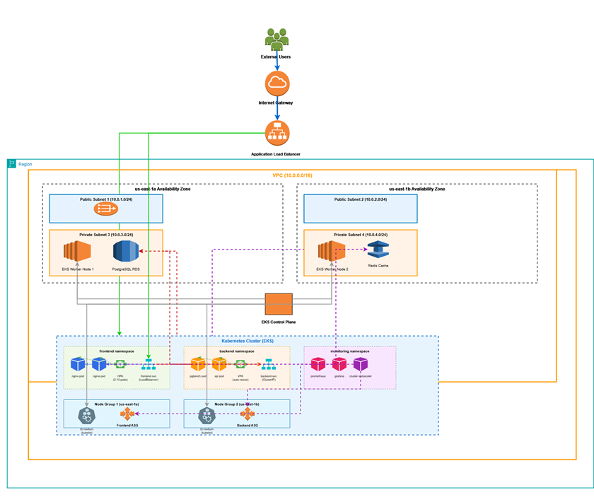

# Infrastructure Architecture Documentation

## Guru's EKS Microservices Platform

This document provides a comprehensive overview of the infrastructure architecture implemented using Terraform across four main modules: 01-foundation, 03-EKS, 04-EKS-Autoscaler, and 05-data-services.

## Architecture Overview



*Figure 1: Complete AWS EKS Microservices Platform Architecture*

### Module Flow

```text
┌─────────────┐     ┌─────────────┐     ┌─────────────┐     ┌─────────────┐
│01-Foundation│────▶│   03-EKS    │────▶│04-Autoscaler│────▶│05-Data-Svcs │
│  (Network)  │     │(Kubernetes) │     │(Applications)│     │    (Data)   │
└─────────────┘     └─────────────┘     └─────────────┘     └─────────────┘
```

## Infrastructure Components

### 1. Foundation Layer (01-foundation)
**Purpose**: Establishes the core networking infrastructure

- **VPC**: 10.0.0.0/16 CIDR block
- **Public Subnets**: 10.0.1.0/24, 10.0.2.0/24 (ALB, NAT Gateway)
- **Private Subnets**: 10.0.3.0/24, 10.0.4.0/24 (EKS, Data Services)
- **Internet Gateway**: External connectivity
- **NAT Gateway**: Outbound internet for private subnets
- **Route Tables**: Public and private routing

### 2. EKS Layer (03-EKS)
**Purpose**: Managed Kubernetes infrastructure

- **EKS Cluster**: Version 1.30 with public/private endpoints
- **Node Group**: t3.medium instances, 1-8 nodes (desired: 2)
- **IAM Roles**: Cluster and worker node service roles
- **Security Groups**: API server and node communication

### 3. Application Layer (04-EKS-Autoscaler)
**Purpose**: Microservices platform with auto-scaling

- **Namespace**: guru-microservices-platform
- **Frontend Service**: nginx with LoadBalancer, HPA enabled
- **Backend Service**: PostgreSQL benchmark workload
- **Metrics Server**: Resource monitoring for HPA
- **Cluster Autoscaler**: Dynamic node scaling

### 4. Data Services Layer (05-data-services)
**Purpose**: Managed data storage and messaging

- **PostgreSQL RDS**: db.t3.micro, PostgreSQL 15.7
- **Redis ElastiCache**: cache.t3.micro, Redis 7
- **MSK Kafka**: kafka.t3.small, 2 brokers, Kafka 3.7.x

## Traffic Flow

1. **External Access**: Users → IGW → ALB → Frontend Service → Frontend Pods
2. **Internal Communication**: Frontend Pods → Backend Service → Backend Pods → PostgreSQL
3. **Caching**: Frontend Pods → Redis Cache
4. **Event Streaming**: Backend Pods → Kafka
5. **Auto-scaling**: Metrics Server → HPA → Frontend Pods
6. **Node Scaling**: Cluster Autoscaler → Worker Nodes

## Key Features

### 🌐 Networking
- Multi-AZ deployment across 2 availability zones
- Public subnets for external-facing services
- Private subnets for secure workload placement
- NAT Gateway for outbound internet access

### 🚀 Kubernetes (EKS)
- Managed control plane with high availability
- Auto-scaling node groups (1-8 nodes)
- Private endpoint for secure cluster communication
- Public endpoint for kubectl access

### 📈 Auto-scaling
- **Horizontal Pod Autoscaler (HPA)**: CPU-based scaling for frontend (2-10 replicas)
- **Cluster Autoscaler**: Dynamic node provisioning based on demand
- **Metrics Server**: Real-time resource monitoring

### 💾 Data Services
- **PostgreSQL RDS**: Persistent data storage with automated backups
- **Redis ElastiCache**: Session management and caching
- **MSK Kafka**: Event streaming and messaging
- All data services in private subnets for security

### 🔐 Security
- IAM roles with least privilege principles
- Security groups for network-level access control
- Private subnet placement for sensitive workloads
- VPC-native networking for isolation

## Deployment Workflow

```bash
# 1. Deploy foundation infrastructure
cd 01-foundation/
terraform init && terraform apply

# 2. Deploy EKS cluster
cd ../03-EKS/
terraform init && terraform apply

# 3. Deploy microservices and autoscaling
cd ../04-EKS-Autoscaler/
terraform init && terraform apply

# 4. Deploy data services
cd ../05-data-services/
terraform init && terraform apply
```

## Module Dependencies

Each module depends on outputs from previous layers via Terraform remote state:

- **03-EKS** → depends on **01-foundation** (VPC, subnets)
- **04-EKS-Autoscaler** → depends on **03-EKS** (cluster endpoint)
- **05-data-services** → depends on **01-foundation** (VPC, subnets)

## Monitoring and Operations

### Auto-scaling Behavior
- **Frontend HPA**: Scales based on CPU utilization (target: 50%)
- **Cluster Autoscaler**: Monitors unschedulable pods and scales nodes
- **Database Load**: Backend pods run continuous PostgreSQL benchmarks

### Access Points
- **Frontend**: Accessible via AWS LoadBalancer (public)
- **Backend Services**: Internal ClusterIP services
- **Data Services**: Accessible only from VPC CIDR ranges

## Resource Specifications

| Component | Instance Type | Scaling | Network |
|-----------|---------------|---------|---------|
| EKS Nodes | t3.medium | 1-8 nodes | Private |
| PostgreSQL | db.t3.micro | Single instance | Private |
| Redis | cache.t3.micro | Single node | Private |
| Kafka | kafka.t3.small | 2 brokers | Private |
| Frontend Pods | - | 2-10 replicas | Private |

## Security Groups

| Service | Port | Source | Purpose |
|---------|------|--------|---------|
| EKS API | 443 | 0.0.0.0/0 | Kubernetes API access |
| PostgreSQL | 5432 | VPC CIDR | Database connections |
| Redis | 6379 | VPC CIDR | Cache access |
| Kafka | 9092-9094 | VPC CIDR | Message broker |

This architecture provides a production-ready, scalable microservices platform on AWS with comprehensive auto-scaling, monitoring, and data services.
